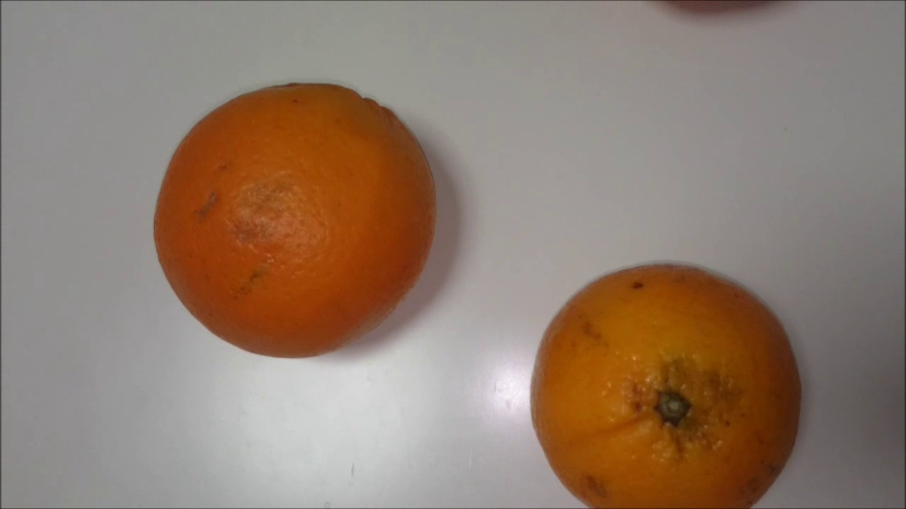

# Orange Sorting Vision

A real-time computer vision pipeline that watches oranges moving on a conveyor, counts them, measures each one, and grades it by size and skin quality — built from scratch on top of raw pixel buffers, without relying on OpenCV's higher-level detection APIs.



## What it does

The program reads a video feed frame by frame and, for every frame:

1. Converts BGR → RGB → HSV.
2. Segments the HSV image with tuned thresholds to isolate orange-coloured regions.
3. Cleans up the binary mask with a morphological closing (dilate → erode).
4. Labels connected components (blobs) with a custom flood-fill labeller and computes each blob's bounding box, area, perimeter and centroid.
5. Filters blobs by minimum area and "extent" (area / bounding-box area) to reject noise and merged/occluded shapes.
6. Tracks each orange across frames by bounding-box overlap, assigning a persistent ID and tolerating a few frames of disappearance (occlusion) before dropping it.
7. Converts the pixel diameter to millimetres using a fixed pixel-to-mm calibration, classifies the orange into a caliber/size bracket and a quality category, and overlays the result on the video.

Everything from the colour-space conversion to the blob labelling and morphological operators is a hand-written implementation (`vc.c` / `vc.h`) — OpenCV is only used for video capture, display and drawing the overlay.

## Tech stack

- **C / C++** — image processing core (`vc.c`, `vc.h`)
- **OpenCV** — video I/O, window display, overlay rendering
- **Visual Studio** — build tooling (`.sln` / `.vcxproj`)

## Project structure

```
TPVisao/
├── main.cpp        # capture loop, tracking, overlay, caliber/category logic
├── vc.c / vc.h      # image processing library (colour conversion, HSV segmentation,
│                    #   morphological ops, connected-component labelling)
└── data/video.avi   # sample input clip
docs/
└── sample-input-frame.png
```

## Building & running

Requires a local OpenCV install (the compiled binaries aren't checked into this repo).

1. Open `TPVisao.sln` in Visual Studio.
2. Point the project at your OpenCV `include`/`lib` paths and make sure `opencv_world*.dll` (and, for video files, `opencv_videoio_ffmpeg*.dll`) are reachable on `PATH` or next to the executable.
3. Build and run (x64). The app opens two windows — the annotated feed and the intermediate binary mask — and prints running/total counts. Press `q` to quit.

## Author

Guilherme Azeredo — [GitHub](https://github.com/azeredo-99) · [LinkedIn](https://www.linkedin.com/in/guilherme-azeredo-a11bb0254/)
